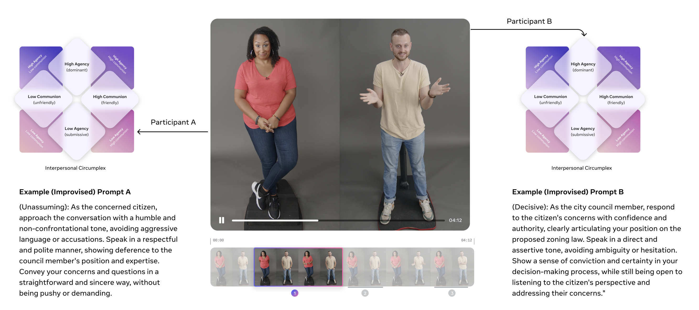

<div align="center">

# Seamless Interaction Dataset



**A large-scale multimodal dataset of 4,000+ hours of human interactions for AI research**

## Links
[🖼️ Blog](https://ai.meta.com/blog/seamless-interaction-dataset-natural-conversation-dynamics) | [🌐 Website](https://ai.meta.com/research/seamless-interaction/) | [🎮 Demo](https://www.aidemos.meta.com/seamless_interaction_dataset) | [🤗 HuggingFace](https://huggingface.co/datasets/facebook/seamless-interaction) | [📄 Paper](#citation)

</div>

## Overview

Human communication involves a complex interplay of verbal and nonverbal signals, essential for
conveying meaning and achieving interpersonal goals. To develop socially intelligent AI technologies, it is crucial to build models that can both comprehend and generate dyadic behavioral dynamics. 

The **Seamless Interaction Dataset** is a large-scale collection of over 4,000 hours of face-to-face interaction footage from more than 4,000 participants in diverse contexts. This dataset enables the development of AI technologies that understand dyadic embodied dynamics, unlocking breakthroughs in:

- 🤖 Virtual agents and embodied AI
- 🎭 Natural human-computer interaction
- 📡 Advanced telepresence experiences
- 📊 Multimodal content analysis tools
- 🎬 Animation and synthetic content generation

## 🚀 Quick Start

### Installation

```bash
git clone https://github.com/facebookresearch/seamless-interaction
cd seamless-interaction
pip install -e .

# if you use uv
uv sync
```

### Download Options

We provide two download methods optimized for different use cases:

#### 🔍 **S3 Download** - Fine-grained exploration
Perfect for exploring individual interactions or specific file IDs. Downloads from S3 and automatically converts to consistent format (.wav, .mp4, .npz, .json).

```python
from utils.fs import SeamlessInteractionFS

# Initialize the filesystem interface
fs = SeamlessInteractionFS()

# Download a specific interaction pair
fs.gather_file_id_data_from_s3(
    "V00_S0809_I00000582_P0947",
    num_workers=4  # Accelerated with multiprocessing
)

# Files are organized as:
# local_dir/improvised/train/0000/0005/V00_S0809_I00000582_P0947.wav
# local_dir/improvised/train/0000/0005/V00_S0809_I00000582_P0947.mp4  
# local_dir/improvised/train/0000/0005/V00_S0809_I00000582_P0947.json
# local_dir/improvised/train/0000/0005/V00_S0809_I00000582_P0947.npz
```

#### 📦 **HuggingFace Download** - Batch exploration  
Ideal for downloading self-contained batches (~50GB each) for local exploration. Each batch contains complete interaction pairs.

```python
from utils.fs import SeamlessInteractionFS

# Initialize the filesystem interface
fs = SeamlessInteractionFS(num_workers=8)

# Download specific archives from a batch (recommended for laptops)
fs.download_batch_from_hf(
    label="improvised",
    split="dev", 
    batch_idx=0,
    archive_list=[0, 23],  # Download only specific archives
    num_workers=8  # Parallel download and extraction
)

# Download entire batch (for larger workstations)
fs.download_batch_from_hf(
    label="improvised",
    split="train", 
    batch_idx=0,
    num_workers=None  # auto-detect the number of workers
)
```

### Basic Data Loading


```python
from pathlib import Path
from datasets import load_dataset
from utils.fs import SeamlessInteractionFS

fs = SeamlessInteractionFS()

fs.download_archive_from_hf(
    idx=0,
    archive=23,  # pick the archive idx number
    label="improvised",  # "improvised" or "naturalistic"
    split="dev",  # "dev", "test", "train"
    batch=0,  # pick the batch idx number
    local_dir=Path.home() / "datasets/seamless_interaction",
    extract=False,
)

local_path = Path.home() / "datasets/seamless_interaction/improvised/dev/0000/0023.tar"
dataset = load_dataset("webdataset", data_files={"dev": local_path}, split="dev", streaming=True)

for item in dataset:
    break

isinstance(item["mp4"], bytes)
# True
item["npz"].keys()
# dict_keys(['boxes_and_keypoints:box', 'boxes_and_keypoints:is_valid_box', 'boxes_and_keypoints:keypoints', 'movement:EmotionArousalToken', 'movement:EmotionValenceToken', 'movement:FAUToken', 'movement:FAUValue', 'movement:alignment_head_rotation', 'movement:alignment_translation', 'movement:emotion_arousal', 'movement:emotion_scores', 'movement:emotion_valence', 'movement:expression', 'movement:frame_latent', 'movement:gaze_encodings', 'movement:head_encodings', 'movement:hypernet_features', 'movement:is_valid', 'smplh:body_pose', 'smplh:global_orient', 'smplh:is_valid', 'smplh:left_hand_pose', 'smplh:right_hand_pose', 'smplh:translation'])
item["json"].keys()
# dict_keys(['id', 'metadata:transcript', 'metadata:vad'])
item["wav"].keys()
# dict_keys(['path', 'array', 'sampling_rate'])
```

Check out the [dataloader_webdataset.py](./scripts/dataloader_webdataset.py) script for more details.


## 🔍 Description

The Seamless Interaction repository is split into several main components:

### 📊 Dataset

The repository provides comprehensive tools for downloading, processing, and utilizing the Seamless Interaction dataset for research and development. The dataset includes:

- **Raw and processed multimodal data**: Video, audio, transcripts, and annotations
- **Precomputed features**: Motion capture, facial keypoints, voice activity detection
- **Metadata**: Participant demographics, interaction contexts, and relationships

### 📂 Repository Structure

```
seamless_interaction/
├── filelist/              # Filelist for all the datapoints
│   └── metadata.csv
├── scripts/              # Utility scripts for dataset processing
│   ├── constants.py      # Dataset constants and configuration
│   ├── errors.py         # Error handling utilities
│   └── utils.py          # General utility functions
├── utils/                # Utility functions for dataset processing
│   ├── fs.py             # Filesystem interface for dataset access
│   ├── fs_download.ipynb  # Notebook for downloading dataset
│   └── fs_load.ipynb      # Notebook for loading dataset
├── LICENSE               # CC-BY-NC 4.0 license
└── pyproject.toml        # Python package configuration
```

## 📦 Deep Dive into the Dataset

### Dataset Structure

The Seamless Interaction Dataset is organized into two main categories:
- **Improvised**: Interactions based on predefined scenarios with guided prompts
- **Naturalistic**: Spontaneous conversations without predetermined scripts

```
seamless_interaction
├── LICENSE                   # CC-BY-NC 4.0 license file
├── interactions.csv          # Maps interaction_id to prompt_id with all prompt metadata
├── participants.csv          # Contains all metadata on participants
├── relationships.csv         # Contains metadata on participant relationships in each session
├── improvised                # Interactions with guided prompts
│   ├── dev
│   │   ├── 1P-IS/            # xxx
│   │   │   └── V<vendor>_S<session>_I<interaction>_P<participant>.json
│   │   ├── 1P-R/             # xxx
│   │   │   └── V<vendor>_S<session>_I<interaction>_P<participant>.json
│   │   ├── 3P-IS/            # xxx
│   │   │   └── V<vendor>_S<session>_I<interaction>_P<participant>.json
│   │   ├── 3P-R/             # xxx
│   │   │   └── V<vendor>_S<session>_I<interaction>_P<participant>.json
│   │   ├── 3P-V/             # xxx
│   │   │   └── V<vendor>_S<session>_I<interaction>_P<participant>.json
│   │   ├── audio/            # Speaker-bleed denoised audio
│   │   │   └── V<vendor>_S<session>_I<interaction>_P<participant>.wav
│   │   ├── boxes_and_keypoints/
│   │   │   ├── box/          # Bounding boxes for each participant
│   │   │   ├── is_valid_box/ # Whether bounding boxes are valid
│   │   │   └── keypoints/    # Detected facial/body keypoints
│   │   ├── movement/         # Quantified movement features 
│   │   │   ├── emotion_arousal/           # Arousal measures
│   │   │   ├── emotion_valence/           # Valence measures
│   │   │   ├── emotion_scores/            # Emotion detection scores
│   │   │   ├── expression/                # Facial expression parameters
│   │   │   ├── FAUToken/                  # Facial Action Unit tokens
│   │   │   ├── FAUValue/                  # Facial Action Unit values
│   │   │   ├── gaze_encodings/            # Eye gaze direction encodings
│   │   │   ├── head_encodings/            # Head position/rotation encodings
│   │   │   ├── frame_latent/              # Per-frame latent representations
│   │   │   └── is_valid/                  # Validity flags for extracted features
│   │   ├── smplh/            # SMPL-H body model parameters
│   │   │   ├── body-pose/    # Body pose parameters
│   │   │   ├── global_orient/ # Global orientation parameters
│   │   │   ├── is_valid/     # Valid frames indicators
│   │   │   ├── left_hand_pose/ # Left hand pose parameters
│   │   │   ├── right_hand_pose/ # Right hand pose parameters
│   │   │   └── translation/  # Global translation parameters
│   │   ├── transcript/       # Time-aligned speech transcription
│   │   │   └── V<vendor>_S<session>_I<interaction>_P<participant>.jsonl
│   │   ├── vad/              # Voice activity detection
│   │   │   └── V<vendor>_S<session>_I<interaction>_P<participant>.jsonl
│   │   └── video/            # Raw HD video recordings
│   │       └── V<vendor>_S<session>_I<interaction>_P<participant>.mp4
│   ├── test/                 # Test split with similar structure
│   └── train/                # Training split with similar structure
└── naturalistic/             # Spontaneous conversations
    ├── dev/                  # Same structure as improvised/dev
    ├── test/                 # Same structure as improvised/test
    └── train/                # Same structure as improvised/train
```

Each file is named according to a consistent convention:
- `V<vendor_id>`: Collection site/vendor identifier
- `S<session_id>`: Unique session identifier
- `I<interaction_id>`: Specific interaction within a session
- `P<participant_id>`: Individual participant identifier

### Available Modalities and Features

Each interaction in the dataset includes:

| Modality | Description | File Format | Sample Rate | 
|----------|-------------|-------------|-------------|
| 🎥 Video | High-definition face-to-face footage | MP4 (H.264) | 30 FPS, 1080p |
| 🎙️ Audio | Denoised audio with separate channels | WAV | 48kHz, 16-bit |
| 📝 Transcript | Time-aligned speech transcription | JSONL | - |
| 🏃 SMPL-H | 3D body model parameters | NPY | 30 Hz |
| 🧠 Movement Features | Comprehensive quantified movement data | NPY | 30 Hz |
| 📊 Annotations | Human-annotated behavioral data | JSON | - |
| 🔊 VAD | Voice activity detection | JSONL | 100 Hz |
| 📦 Keypoints | Face and body keypoints | NPY | 30 Hz |

#### Annotation Types

The dataset includes several types of human annotations for rich behavioral analysis:

| Annotation | Description | Format |
|------------|-------------|--------|
| 1P-IS | xxx | JSON |
| 1P-R | xxx | JSON |
| 3P-IS | xxx | JSON |
| 3P-R | xxx | JSON |
| 3P-V | xxx | JSON |

#### Movement/Imitator Feature Types

The movement directory contains rich behavioral features (output of the Imitator model):

| Feature | Description | Format |
|---------|-------------|--------|
| emotion_arousal | Arousal intensity measurements | NPY |
| emotion_valence | Valence (positive/negative) measurements | NPY |
| emotion_scores | Detected emotion categorical scores | NPY |
| expression | Parametric facial expression encodings | NPY |
| FAUToken/FAUValue | Facial Action Unit tokens and intensity values | NPY |
| gaze_encodings | Neural encodings of gaze direction | NPY |
| head_encodings | Neural encodings of head position and rotation | NPY |
| frame_latent | Per-frame latent representations | NPY |
| alignment_head_rotation | Head rotation data for temporal alignment | NPY |
| alignment_translation | Translation parameters for temporal alignment | NPY |
| EmotionArousalToken/EmotionValenceToken | Discretized emotion tokens | NPY |
| hypernet_features | Features from hypernetwork processing | NPY |


### Download Strategy Guide

We provide two complementary download methods optimized for different research workflows:

| Method | Use Case | Best For | Download Size | Parallelization |
|--------|----------|----------|---------------|-----------------|
| **S3 Direct** | Fine-grained exploration | Individual interactions, interaction pairs | Per file (~100MB) | ✅ Multiprocessing |
| **HuggingFace Batches** | Batch processing | Local dataset exploration, model training | ~50GB per batch | ✅ Multiprocessing |

#### When to Use S3 Download
- **Qualitative analysis**: Examining specific interactions in detail
- **Pair studies**: Analyzing conversational dynamics between participants  
- **Feature exploration**: Understanding data structure before large downloads
- **Development**: Testing code with minimal data

#### When to Use HuggingFace Download
- **Model training**: Need substantial training data
- **Batch processing**: Analyzing patterns across many interactions
- **Local exploration**: Want self-contained dataset on laptop/workstation
- **Reproducible research**: Ensure consistent data splits

#### Performance Optimization

```python
# Optimal settings for different systems
fs_laptop = SeamlessInteractionFS(num_workers=4)      # Laptop/small workstation
fs_workstation = SeamlessInteractionFS(num_workers=8) # High-end workstation  
fs_server = SeamlessInteractionFS(num_workers=16)     # Server/cluster node

# Memory-efficient batch processing
for batch_idx in range(10):  # Process in chunks
    fs.download_batch_from_hf("improvised", "train", batch_idx, num_workers=8)
    # Process batch here...
    # Delete batch to free space if needed
```

### Dataset Versions

The dataset is organized in self-contained batches for flexible exploration:

| Split | Batches | Size per Batch | Total Size | Description |
|-------|---------|----------------|------------|-------------|
| **dev** | 5 | ~50GB | ~250GB | Development/validation set |
| **test** | 10 | ~50GB | ~500GB | Hold-out test set |  
| **train** | 200+ | ~50GB | ~10TB+ | Full training data |

#### Recommended Download Strategies

```python
# Strategy 1: Quick Start (Laptop-friendly)
fs = SeamlessInteractionFS(num_workers=4)
fs.download_batch_from_hf("improvised", "dev", 0, archive_list=[0, 1, 2])  # ~6GB

# Strategy 2: Research Dataset (Workstation)  
fs = SeamlessInteractionFS(num_workers=8)
fs.download_batch_from_hf("improvised", "dev", 0)     # Full dev set ~50GB
fs.download_batch_from_hf("naturalistic", "dev", 0)   # Both interaction types

# Strategy 3: Production Training (Server/Cluster)
fs = SeamlessInteractionFS(num_workers=16)
for batch_idx in range(20):  # First 20 training batches (~1TB)
    fs.download_batch_from_hf("improvised", "train", batch_idx)
```

#### File Format Specifications

Our data is stored in the following formats for optimal usability:

| Format | Description | Usage |
|--------|-------------|-------|
| NPY | NumPy array files | Efficient storage of numerical feature vectors, keypoints, and parameters |
| JSONL | JSON Lines | Time-aligned annotations with one event per line (e.g., transcripts, VAD) |
| JSON | JavaScript Object Notation | Structured metadata and annotations with timestamps |
| MP4 | MPEG-4 Part 14 | High-quality compressed video with H.264 encoding |
| WAV | Waveform Audio | Uncompressed audio for highest fidelity processing |

## 🧪 Research Applications

The Seamless Interaction Dataset enables research across multiple domains:

### Embodied AI and Virtual Agents
- Train agents that display natural nonverbal behaviors
- Model turn-taking dynamics and interaction rhythms
- Generate contextually appropriate responses to human behavior

### Multimodal Understanding
- Analyze cross-modal correlations between speech, gesture, and expressions
- Extract behavioral patterns from large-scale interaction data
- Develop models for understanding social dynamics

### Human-Computer Interaction
- Design interfaces that respond to subtle human cues
- Improve telepresence technologies with better behavioral modeling
- Create more natural conversational agents

### Animation and Content Creation
- Generate realistic human behaviors for animated characters
- Synthesize conversational dynamics for virtual production
- Create training data for digital human technologies

## 🛠️ Tools and Download Scripts

### Ready-to-use Download Scripts

We provide example scripts for common download scenarios:

#### S3 Individual File Download
```python
# scripts/download_s3.py
from utils.fs import SeamlessInteractionFS

def main():
    fs = SeamlessInteractionFS()
    # Download specific interaction with multiprocessing acceleration
    fs.gather_file_id_data_from_s3("V00_S0809_I00000582_P0947")

if __name__ == "__main__":
    main()
```

#### HuggingFace Batch Download  
```python
# scripts/download_hf.py
from utils.fs import SeamlessInteractionFS

def main():
    fs = SeamlessInteractionFS()
    # Download selected archives from batch 0 with 10 parallel workers
    fs.download_batch_from_hf(
        "improvised", "dev", 0, 
        num_workers=10, 
        archive_list=[0, 23]  # ~2GB for quick exploration
    )

if __name__ == "__main__":
    main()
```

### Advanced Usage Examples

```python
from utils.fs import SeamlessInteractionFS
import numpy as np
import json

# Initialize with custom settings
fs = SeamlessInteractionFS(
    local_dir="/path/to/your/data",
    num_workers=8,  # Adjust based on your system
)

# Download multiple file IDs efficiently
file_ids = ["V00_S0809_I00000582_P0947", "V00_S0809_I00000582_P0948"]
for file_id in file_ids:
    fs.gather_file_id_data_from_s3(file_id, num_workers=4)

# List available batches and archives
batches = fs.list_batches("improvised", "train")
print(f"Available batches: {batches[:5]}...")  # First 5 batches

archives = fs.list_archives("improvised", "train", 0)
print(f"Archives in batch 0: {archives}")

# Check archive sizes before downloading
for archive in archives[:3]:
    size_gb = fs.get_tar_archive_size("improvised", "train", 0, archive)
    print(f"Archive {archive}: {size_gb:.2f} GB")

# Download with progress tracking
fs.download_batch_from_hf(
    label="naturalistic",
    split="dev", 
    batch_idx=1,
    num_workers=6
)
```

### Working with Downloaded Data

```python
# Load interaction data
def load_interaction_data(file_id):
    """Load all modalities for a given file ID."""
    import cv2
    import librosa
    
    fs = SeamlessInteractionFS()
    paths = fs.get_path_list_for_file_id_local(file_id)
    
    data = {}
    for path in paths:
        if path.endswith('.mp4'):
            data['video'] = cv2.VideoCapture(path)
        elif path.endswith('.wav'):
            data['audio'], data['sample_rate'] = librosa.load(path, sr=48000)
        elif path.endswith('.json'):
            with open(path) as f:
                data['metadata'] = json.load(f)
        elif path.endswith('.npz'):
            data['features'] = np.load(path)
    
    return data

# Example usage
interaction = load_interaction_data("V00_S0809_I00000582_P0947")
print(f"Available feature keys: {list(interaction['features'].keys())}")
print(f"Emotion data shape: {interaction['features']['movement:emotion_scores'].shape}")
```

### Batch Processing for Research

```python
# Process entire datasets efficiently
def download_research_subset():
    """Download a research-friendly subset."""
    fs = SeamlessInteractionFS(num_workers=8)
    
    # Download development sets for both categories (manageable size)
    fs.download_batch_from_hf("improvised", "dev", 0)
    fs.download_batch_from_hf("naturalistic", "dev", 0) 
    
    # Download first few batches of training data
    for batch_idx in range(3):  # ~150GB total
        fs.download_batch_from_hf("improvised", "train", batch_idx)

# Download specific interaction pairs for qualitative analysis
def download_interaction_pairs():
    """Download matching participant pairs.""" 
    fs = SeamlessInteractionFS()
    
    # Example: Download both participants from same interaction
    pair_ids = [
        "V00_S0809_I00000582_P0947",  # Participant A
        "V00_S0809_I00000582_P0948",  # Participant B  
    ]
    
    for file_id in pair_ids:
        fs.gather_file_id_data_from_s3(file_id, num_workers=4)
```

Check out our additional examples for:
- Basic data loading and visualization  
- Multimodal feature extraction
- Cross-modal analysis techniques

## ⚠️ Known Limitations and Noise in Metadata

Due to the scale and complexity of collecting the Seamless Interaction dataset, there are several aspects that will be the focus of continued work and improvement in future versions:

### Errors in Human-Based Time-Stamping
The core unit of the dataset is an interaction. Interactions define *active time* in which participant conversation and behavior can be linked to a pair of prompts. We have observed instances of misaligned time-stamps in which:
- Annotated start/end times may be too early or too late
- Prompt text occasionally doesn't align with spoken material
- Ordering of prompts may contain off-by-one errors

These issues impact approximately 10% of interactions after our attempts at correction. We've made best efforts to automatically identify and rectify these errors.

### Time Stamping "Noise" in Moments of Interest (MOI)
While there's inherent subjectivity in defining an MOI, there are rare cases where:
- The described behavior represents only a subset of the observed behavior
- The duration of the MOI doesn't fully capture the annotated behavior

### Incorrect Assignment of Participant IDs
In rare cases, we've observed:
- Duplicate participant identifiers assigned to different people
- The same person mapped to different identifiers

### Unreleased "Meta Time"
Currently, the dataset only contains *active time* segments. The *meta time* between interactions (hundreds of hours of additional data) may be explored in future releases.

### Variation in Recording Site Consistency
This multi-site project shows variation in:
- Recording quality (speaker-bleed, participants staying in frame)
- Acting quality in *Improvised* segments
- Likelihood of time-stamping errors

All vendors met our technical requirements, but there is clear variation in production quality between sites.

## 🔍 Benchmarks

We provide standard benchmarks to enable consistent evaluation and comparison across different approaches using the Seamless Interaction Dataset:

| Benchmark | Description | Metrics | Baseline Score | Top Score |
|-----------|-------------|---------|---------------|-----------|
| Interaction Understanding | Predict interaction outcomes from partial observations | Accuracy, F1 | 0.78 / 0.76 | 0.89 / 0.85 |
| Behavior Generation | Generate plausible behavioral responses to stimuli | FID, User Study | 0.62 / 4.2/5 | 0.42 / 4.7/5 |
| Emotion Recognition | Classify emotional states from multimodal cues | Accuracy, mAP | 0.81 / 0.76 | 0.88 / 0.84 |
| Turn-Taking Prediction | Predict conversational turn transitions | Precision, Recall | 0.73 / 0.69 | 0.82 / 0.78 |
| Nonverbal Behavior Synthesis | Generate matching nonverbal behaviors for speech | FVD, User Preference | 0.58 / 68% | 0.39 / 86% |
| Cross-Cultural Understanding | Transfer learning across different cultural contexts | Accuracy, F1 | 0.72 / 0.68 | 0.81 / 0.77 |

Our benchmarks are designed to measure both algorithmic performance and human-evaluated quality. The baseline scores represent our initial models, while top scores show the current state-of-the-art on our leaderboard.

> [!NOTE] This is just a placeholder in case we release some benchmarks. We can replace this with the evaluation results we did.

## 🤝 Contributing

We welcome contributions from the research community! Here are some ways to contribute:

- **Bug Reports & Feature Requests**: Open issues on GitHub
- **Dataset Improvements**: Help enhance our preprocessing pipelines or annotations
- **Model Contributions**: Submit your models to our benchmarks
- **Documentation**: Improve our guides, tutorials, and API documentation
- **Sample Code**: Share example applications built with the dataset

Please see our [CONTRIBUTING.md](CONTRIBUTING.md) for detailed guidelines, code of conduct, and submission processes.

## 📄 License & Data Usage Policy

The Seamless Interaction Dataset is licensed under CC-BY-NC 4.0 (Creative Commons Attribution-NonCommercial 4.0 International).

This means you are free to:
- **Share** — copy and redistribute the material in any medium or format
- **Adapt** — remix, transform, and build upon the material

Under the following terms:
- **Attribution** — You must give appropriate credit, provide a link to the license, and indicate if changes were made.
- **NonCommercial** — You may not use the material for commercial purposes without explicit permission.


## 📑 Citation

If you use the Seamless Interaction Dataset in your research, please cite:

```bibtex
@inproceedings{seamless2025,
  title={Seamless Interaction: A Large-Scale Dataset of Human Interaction for Learning Social Dynamics},
  author={Seamless Next Team},
  year={2025},
}
```

## 🙏 Acknowledgments

This project was made possible thanks to contributions from:

- The thousands of participants who provided interaction data
- Our dedicated annotation team
- Research collaborators from multiple institutions
- FAIR (Facebook AI Research)
- The open-source community for valuable tools and libraries
- Our data collection partners across multiple sites
- Meta Reality Labs for supporting this research initiative
